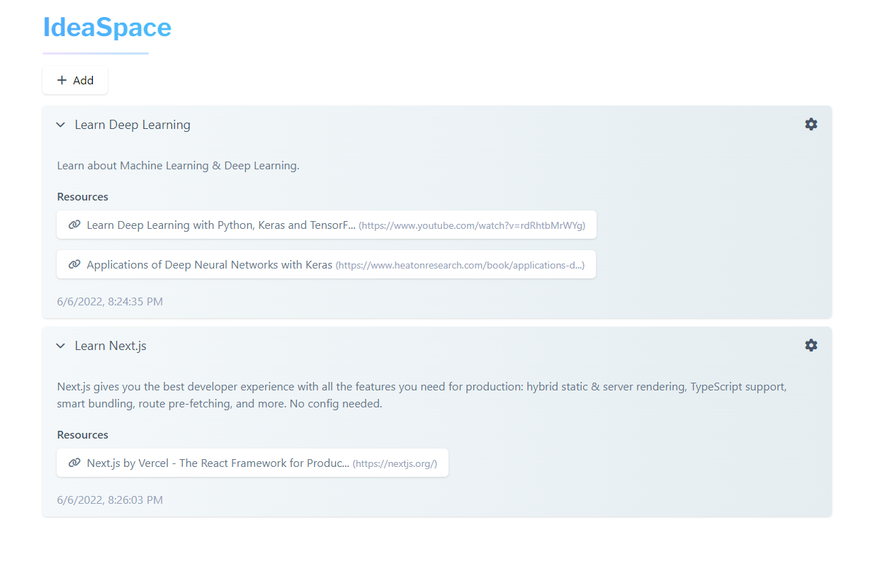

# IdeaSpace
IdeaSpace is a web-app I made to learn Next.js. It is an app to keep track of your ideas. Created with Next.js, MongoDB & TailwindCSS.



## Getting Started

To run the development server execute:

```bash
npm run dev
# or
yarn dev
```

Open [http://localhost:3000](http://localhost:3000) with your browser to see the result.

## Environment variables

MONGODB_URI=`insert mongoDB url here`
  
MONGODB_DB_NAME=`insert mongoDB database name here`

MONGODB_COLLECTION=`insert mongoDB collection name here`

NEXT_PUBLIC_DEPLOY_URL=`insert deployment url here`


## Next.js

This is a [Next.js](https://nextjs.org/) project bootstrapped with [`create-next-app`](https://github.com/vercel/next.js/tree/canary/packages/create-next-app).